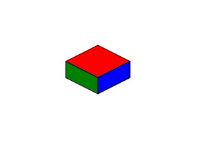

# CHAOS DOM ENGINE (CDE)
An open-source game development library that runs entirely on the DOM.

## FAQ
### But the DOM is so slow and games are meant to be FAST!!!
Well... Not all games need to super fast.  I want to make a 2D game made up entirely of Vector Graphics and, unless I felt like developing an entirely new kind of graphics rendering engine, HTML5 does it best with SVGs. (as far as I know).   HTML/CSS is also great for creating fast and fancy looking User Interfaces AND, SVGs being a living part of the DOM means that you can easily edit them via CSS as well.

### Why create it as a node package?
The game I'm working on is meant to be highly mod-able, so having access to a fast and reliable file system is paramount.  Despite the game being run on the DOM, I do not intend to make it into a browser game and am instead running it via Electron.  Node is also a great platform for distribution of open-source projects.

### Do you plan on releasing a web-friendly version?
Probably.  I (or someone who wants to contribute) will just need to remove all path/fs capabilities from the engine.  In which case, any elements must already exist on the DOM or as stringified versions of themselve in some JavaScript files (or something of the like)

### Why doesn't the "engine" support raster graphics like .jpeg or .png
The game I'm developing doesn't use any raster graphics, so I haven't had any reason to add them to the "engine".

## Documentation
### Quick Start Guide
In its current state, CDE will not run in a browser, so you're going to need to set up a node-friendly desktop app.  I'm using Electron, but I also like Neutralinojs.
* [Electron](https://www.electronjs.org)
* [Neutralinojs](https://neutralino.js.org/)

Once your desktop framework is set up, you should be able to start working on your game.  Here's a quick snippet to get an SVG to render on-screen.  

First, you'll need to add `chaos-dom-engine` to your npm project.

```
npm i chaos-dom-engine
```

Your index.html file should look like this
./index.html
```html
<!DOCTYPE html>
<html>
  <head>
    <meta charset="UTF-8">
    <!-- https://developer.mozilla.org/en-US/docs/Web/HTTP/CSP -->
    <meta http-equiv="Content-Security-Policy" content="default-src 'self'; style-src 'self' 'unsafe-inline'">
    <title>Your Game Title Here</title>
    <link rel="stylesheet" href="./static/styles.css">
  </head>
  <body>
    <script src="./build/renderer.js"></script>
  </body>
</html>
```
Add a CSS file at `./static/style.css`.  This will handle some of the elements that will be injected into your game.  You can also use this file to style your UI and add reactive actions like hover to your in-game SVG elements.

./static/style.css
```css
body {
  overflow: hidden;
}

svg {
  overflow: visible;
}

#image-bucket {
  position: absolute;
  top: 100%;
  display: none;
}

#game {
  position: absolute;
  top: 0px;
  bottom: 0px;
  left: 0px;
  right: 0px;
}
```

Then we can start coding.  In an electron app, this should be in your renderer.js file

./renderer.js
```javascript
import {SceneManager, Component, ImageLoader, initAll, Render} from 'chaos-dom-engine'

// For the sake of simplicity, we're going to load our svg as a string
// Note that the fill attributes are marked with double curly brackets {{}}.  This is to denote that they are variables to be replaced.
const SVG_STRING = `
<svg version="1.1" id="Layer_1"
    xmlns="http://www.w3.org/2000/svg"
    xmlns:xlink="http://www.w3.org/1999/xlink" x="0px" y="0px" width="100px" height="75px" viewBox="0 0 100 75" xml:space="preserve">
    <polygon class="tile top overlap-hover" pointer-events="all" fill="{{top}}" points="0,25 50,0 100,25 50,50 "/>
    <polygon class="tile side a" fill="{{side_a}}" points="50,50 100,25 100,50 50,75 "/>
    <polygon class="tile side b" fill="{{side_b}}" points="50,50 0,25 0,50 50,75 "/>
</svg>
`

// Create an empty scene
SceneManager.newScene('Test Scene')
// Assign the active scene
const ACTIVE_SCENE = SceneManager.getActiveScene()
// Create a new GameObject
const gameObject = {
  active: true,
  components: [
    {
      type: Component.ComponentType.Transform,
      active: true,
      position: { x: 500, y: 500 },
      scale: { x: 1, y: 1 }
    },
    {
      type: Component.ComponentType.Image,
      active: true,
      element: ImageLoader.loadSVG(
        SVG_STRING,
        // colors: this will replace the open variables in the SVG_STRING with the designated colors
        { top: 'red', side_a: 'blue', side_b: 'green' }
      ),
      depth: 1
    }
  ],
  children: []
}

// Add the game object to the scene
ACTIVE_SCENE.objects.push(gameObject)

// Initialize CDE and begin game render loop
window.onload = () => {
  initAll()
  Render.renderLoop()
}
```

Next time you run your game, the following image should render on screen

